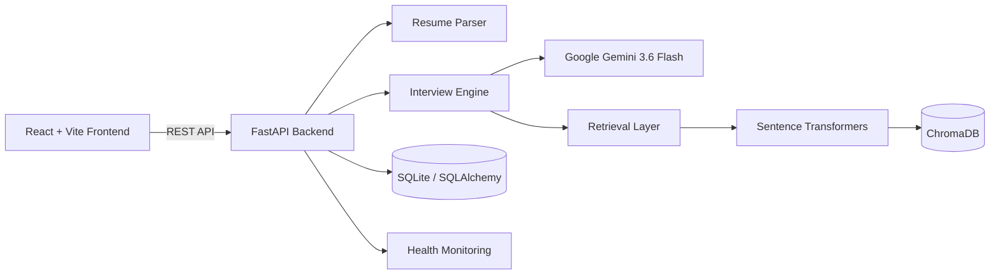

# 🎯 ApexScreen AI

**An AI-powered interview platform:** upload a resume, configure an interview, and conduct structured AI-driven interviews with resume-aware question generation, persistent interview sessions, and performance insights.


**Jump to:** [Features](#-features) · [Architecture](#-architecture) · [Tech Stack](#-tech-stack) · [API](#-api) · [Setup](#-setup) · [Docker](#-docker) · [Testing](#-testing) · [Limitations](#-limitations)

---

## ✨ Features

- **Resume-aware interviewing:** Upload a candidate resume and use extracted information as interview context.
- **AI-generated questions:** Generate interview questions using Google Gemini.
- **Structured interview sessions:** Create and manage interview sessions with persistent state.
- **Resume parsing:** Process uploaded PDF resumes and extract relevant candidate information.
- **Semantic retrieval:** Use Sentence Transformers embeddings with ChromaDB for vector-based retrieval.
- **Gemini integration:** Support for Google's Gemini LLM through the `google-genai` SDK.
- **Mock/Demo provider:** Run and test the application without a live Gemini API key.
- **Persistent application data:** Store interview and application state using SQLAlchemy and SQLite.
- **REST API:** FastAPI-based backend with OpenAPI/Swagger documentation.
- **Modern frontend:** React + Vite interface for interacting with the interview platform.
- **Docker support:** Containerized backend setup using Docker and Docker Compose.
- **Health monitoring:** Dedicated health endpoints expose application, database, vector database, and LLM availability.

---

## 🧠 How It Works

```text
Resume Upload
      ↓
PDF Resume Parsing
      ↓
Candidate Information
      ↓
Interview Configuration
      ↓
Knowledge / Context Retrieval
      ↓
Gemini AI
      ↓
Interview Questions
      ↓
Candidate Responses
      ↓
Interview Session & Analytics
```

The application can also operate in **Mock/Demo Provider** mode when a Gemini API key is not configured, allowing the application workflow to be tested without a live LLM connection.

---

## 🏗️ Architecture



### Architecture Overview

- **React + Vite** provides the user-facing interface.
- **FastAPI** exposes the backend REST API.
- **Resume Parser** processes uploaded PDF resumes.
- **Interview Engine** manages interview sessions and AI-driven question generation.
- **Google Gemini** provides the LLM layer when configured.
- **Sentence Transformers** generate semantic embeddings.
- **ChromaDB** provides vector storage and retrieval.
- **SQLAlchemy + SQLite** handle persistent application data.
- **Docker** provides containerized deployment support.

---

## 🛠️ Tech Stack

<details>
<summary><b>Backend</b></summary>

| Area | Technology |
|---|---|
| Language | Python |
| API Framework | FastAPI |
| ASGI Server | Uvicorn |
| Validation | Pydantic |
| ORM | SQLAlchemy |
| Database | SQLite |
| PDF Processing | PyMuPDF |
| Testing | Pytest |
| HTTP Client | HTTPX |

</details>

<details>
<summary><b>AI / ML</b></summary>

| Area | Technology |
|---|---|
| LLM | Google Gemini 3.6 Flash |
| Gemini SDK | `google-genai` |
| Embeddings | Sentence Transformers |
| Embedding Model | `all-MiniLM-L6-v2` |
| Vector Database | ChromaDB |
| Retrieval | Semantic / Vector Retrieval |

</details>

<details>
<summary><b>Frontend & Infrastructure</b></summary>

| Area | Technology |
|---|---|
| Frontend | React |
| Build Tool | Vite |
| Containerization | Docker |
| Orchestration | Docker Compose |
| API Documentation | OpenAPI / Swagger UI |

</details>

---

## 📡 API

The backend exposes a REST API with interactive documentation through Swagger UI.

### Health

| Method | Endpoint | Description |
|---|---|---|
| `GET` | `/health` | Application health status |
| `GET` | `/api/health` | API-prefixed health status |

The health response reports information such as:

- Application status
- LLM availability
- Active LLM mode
- Database connectivity
- Vector database connectivity
- Embedding model
- Knowledge-base indexing status

### Documents / Resume

| Method | Endpoint | Description |
|---|---|---|
| `POST` | `/api/v1/documents` | Upload and process a document |
| `GET` | `/api/v1/documents/{document_id}` | Retrieve document status/details |

### Interview

| Method | Endpoint | Description |
|---|---|---|
| `POST` | `/api/v1/interviews` | Create an interview session |
| `GET` | `/api/v1/interviews/{interview_id}` | Retrieve interview information |
| `GET` | `/api/v1/interviews/{interview_id}/current-question` | Retrieve the current interview question |

> The complete API reference is available through Swagger UI at `/docs`.

### Interactive API Documentation

After starting the backend:

```text
http://localhost:8000/docs
```

OpenAPI schema:

```text
http://localhost:8000/openapi.json
```

---

## 🚀 Setup

### Requirements

- Python **3.11–3.13**
- Node.js **18+**
- Git
- Optional: Google Gemini API key
- Optional: Docker Desktop

> Python 3.14+ may require building `chroma-hnswlib` locally on Windows if a compatible prebuilt wheel is unavailable.

### Clone the Repository

```bash
git clone https://github.com/Sajal-10903/apexscreen-ai.git
cd apexscreen-ai
```

### Backend Setup

Create a virtual environment:

```bash
python -m venv .venv
```

#### Windows PowerShell

```powershell
.\.venv\Scripts\Activate.ps1
```

#### macOS / Linux

```bash
source .venv/bin/activate
```

Install dependencies:

```bash
pip install -r requirements.txt
```

### Environment Configuration

Create a local `.env` file:

```powershell
Copy-Item .env.example .env
```

Or on macOS/Linux:

```bash
cp .env.example .env
```

Configure your Gemini API key if live Gemini functionality is required:

```env
GEMINI_API_KEY=your_api_key_here
```

The supported Gemini model is:

```env
GEMINI_MODEL=gemini-3.6-flash
```

> Never commit `.env` or API keys to the repository.

### Start the Backend

```bash
uvicorn backend.app.main:app --reload
```

Backend:

```text
http://localhost:8000
```

Swagger UI:

```text
http://localhost:8000/docs
```

---

## 🖥️ Frontend

Open a second terminal:

```bash
cd frontend
npm install
npm run dev
```

Vite will provide the frontend URL, typically:

```text
http://localhost:5173
```

The frontend communicates with the FastAPI backend through the configured API endpoint.

---

## 🐳 Docker

Docker and Docker Compose configuration is included.

Build and start:

```bash
docker compose up --build
```

Run in detached mode:

```bash
docker compose up -d --build
```

Stop the application:

```bash
docker compose down
```

The Docker setup supports:

```env
GEMINI_API_KEY
GEMINI_MODEL
```

Default model:

```text
gemini-3.6-flash
```

---

## 🧪 Testing

The project includes an automated backend test suite.

Run:

```bash
pytest backend/tests/ -q
```

### Verified Test Result

```text
36 passed
6 warnings
```

The backend test suite was successfully executed after resolving the Pydantic dependency compatibility issue.

The dependency was updated from:

```text
pydantic==2.12.4
```

to:

```text
pydantic==2.12.5
```

---

## ❤️ Health Check

ApexScreen AI exposes two health endpoints:

```text
GET /health
GET /api/health
```

Both endpoints were verified successfully.

Example response:

```json
{
  "status": "healthy",
  "llm_available": false,
  "llm_mode": "Mock/Demo Provider",
  "database": "connected",
  "vector_db": "connected",
  "embedding_model": "all-MiniLM-L6-v2",
  "knowledge_base_indexed": false
}
```

When a valid Gemini API key is configured, the application can use the Gemini provider instead of the Mock/Demo provider.

---

## 📁 Project Structure

```text
apexscreen-ai/
│
├── backend/
│   ├── app/
│   └── tests/
│
├── frontend/
│
├── data/
│   └── sample_resume.pdf
│
├── knowledge_base/
│
├── scripts/
│
├── uploads/
│
├── chroma_db/
│
├── .env.example
├── .gitignore
├── Dockerfile
├── docker-compose.yml
├── docker-entrypoint.sh
├── PROJECT_HANDOVER.md
├── README.md
└── requirements.txt
```

Runtime-generated data such as local databases, uploaded files, ChromaDB data, caches, virtual environments, and secrets are excluded from version control.

---

## 🔐 Configuration & Security

Secrets are kept outside the repository.

Example:

```env
GEMINI_API_KEY=your_api_key_here
```

The following should never be committed:

```text
.env
API keys
Credentials
Uploaded user documents
Local databases
Virtual environments
Runtime caches
```

The repository provides `.env.example` as a configuration template.

---

## ⚠️ Limitations

- AI-generated interview questions depend on the configured LLM provider and available context.
- Live Gemini functionality requires a valid Gemini API key.
- The application can run in Mock/Demo Provider mode without a Gemini API key.
- Resume parsing quality depends on the structure and readability of the uploaded PDF.
- Semantic retrieval quality depends on the embedding model and indexed knowledge base.
- Local development uses SQLite.
- ChromaDB data is treated as runtime/local data.
- Uploaded resumes are treated as runtime/local files.
- The current automated tests primarily validate backend functionality and do not represent complete browser-based end-to-end testing.
- Production deployment would require appropriate security, persistent storage, monitoring, and infrastructure configuration.

---

## 📌 Project Status

**Active Development / Portfolio Project**

Current verified status:

- Backend dependencies installed successfully
- `36/36` backend tests passing
- FastAPI application starts successfully
- Graphical React frontend runs successfully
- Swagger UI accessible
- `/health` endpoint verified
- `/api/health` endpoint verified
- Gemini `3.6 Flash` configured
- ChromaDB integration available
- Docker configuration included

---

## 👨‍💻 Author

**Sajal Raj**

- GitHub: [Sajal-10903](https://github.com/Sajal-10903)
- Portfolio: [sajalraj-portfolio.vercel.app](https://sajalraj-portfolio.vercel.app)
- LinkedIn: [Sajal Raj](https://www.linkedin.com/in/sajal-raj-456b31252/)

---

## ⭐ Support

If you find this project useful or interesting, consider giving the repository a star.

**Repository:** [github.com/Sajal-10903/apexscreen-ai](https://github.com/Sajal-10903/apexscreen-ai)
